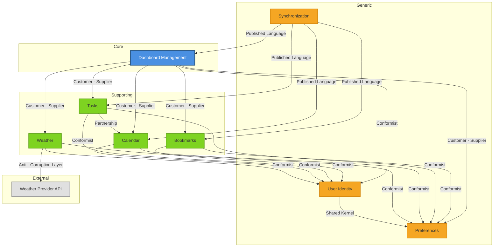

# Bounded Contexts

This section defines the bounded contexts identified in the Browser Dashboard PWA system. Each bounded context
represents a distinct area of the domain with its own models, vocabulary, and boundaries. These contexts align with our
strategic subdomain classification (core, supporting, generic).

## Overview

The Browser Dashboard PWA is divided into the following bounded contexts:

1. **Dashboard Management Context** (Core)
2. **Bookmarks Context** (Supporting)
3. **Tasks Context** (Supporting)
4. **Calendar Context** (Supporting)
5. **Weather Context** (Supporting)
6. **User Identity Context** (Generic)
7. **Preferences Context** (Generic)
8. **Synchronization Context** (Generic)

## Context Definitions

### 1. Dashboard Management Context (Core)

**Purpose**: Orchestrate the composition, layout, and personalization of user dashboards. This is the core
differentiator of the system.

**Ownership**: Dashboard team (in this case, the primary developer)

**Responsibilities**:

- Manage dashboard lifecycle (create, update, delete)
- Handle widget instance placement and configuration
- Enforce layout rules and constraints
- Manage personalization profiles
- Coordinate with other contexts to retrieve widget data

**Key Aggregates**:

- `Dashboard` (root): Owns widget instances and layout configuration
- `WidgetInstance`: Configuration and placement of a widget on a dashboard
- `Layout`: Grid/region definitions and sizing rules

**Published Events**:

- `DashboardCreated`
- `DashboardDeleted`
- `WidgetAddedToDashboard`
- `WidgetRemovedFromDashboard`
- `WidgetConfigurationChanged`
- `WidgetReordered`
- `ProfileSwitched`

**Consumed Events**:

- `UserRegistered` (from User Identity Context)
- `PreferencesUpdated` (from Preferences Context)

**Exposed APIs**:

- Commands: `CreateDashboard`, `DeleteDashboard`, `AddWidget`, `RemoveWidget`, `ConfigureWidget`, `ReorderWidgets`,
  `SwitchProfile`
- Queries: `GetDashboardByUserId`, `GetWidgetInstanceById`, `GetAllProfilesForUser`

**Dependencies**:

- User Identity Context (to validate user ownership)
- Preferences Context (to load theme and default settings)
- Widget-specific contexts (to validate widget types and configurations)

**Boundaries**:

- **In scope**: Dashboard structure, widget placement, layout rules, profile management
- **Out of scope**: Widget-specific business logic (delegated to respective contexts), authentication logic

**Invariants**:

- A dashboard belongs to exactly one user
- A widget instance must reference a valid widget type
- Layout positions cannot overlap
- Each profile must have a unique name per user

---

### 2. Bookmarks Context (Supporting)

**Purpose**: Manage hierarchical bookmarks (folders and links) with quick-access features like speed dial.

**Ownership**: Bookmarks team (in this case, the primary developer)

**Responsibilities**:

- CRUD operations on bookmarks and folders
- Maintain folder hierarchy
- Handle reordering within folders
- Manage pinned/favorite bookmarks
- Provide bookmark data to Dashboard Context for widget display

**Key Aggregates**:

- `Folder` (root): Owns child folders and bookmarks
- `Bookmark`: Link with title, URL, icon/thumbnail

**Published Events**:

- `BookmarkCreated`
- `BookmarkUpdated`
- `BookmarkDeleted`
- `BookmarkPinned`
- `BookmarkUnpinned`
- `FolderCreated`
- `FolderRenamed`
- `FolderDeleted`

**Consumed Events**:

- `UserRegistered` (to create root folder)
- `DashboardCreated` (to initialize bookmark widget if present)

**Exposed APIs**:

- Commands: `CreateBookmark`, `UpdateBookmark`, `DeleteBookmark`, `CreateFolder`, `RenameFolder`, `DeleteFolder`,
  `ReorderBookmarks`, `PinBookmark`
- Queries: `GetAllBookmarks`, `GetBookmarksByFolder`, `GetPinnedBookmarks`, `SearchBookmarks`

**Dependencies**:

- User Identity Context (to scope bookmarks to users)
- Dashboard Management Context (to provide widget data)

**Boundaries**:

- **In scope**: Bookmark and folder management, hierarchy, pinning
- **Out of scope**: Dashboard layout, URL validation beyond basic format checking

**Invariants**:

- Each bookmark belongs to exactly one folder
- URLs must be valid and non-empty
- Folder names must be unique within the same parent
- Cannot delete a folder with children (must be empty or cascade)

---

### 3. Tasks Context (Supporting)

**Purpose**: Provide lightweight personal task management with statuses, priorities, and due dates.

**Ownership**: Tasks team (in this case, the primary developer)

**Responsibilities**:

- CRUD operations on tasks
- Manage task lifecycle (Todo → In-Progress → Done)
- Handle priorities and due dates
- Organize tasks into lists/sections
- Provide task data to Dashboard Context for widget display
- Support task-to-event conversion (initiate, but Calendar Context handles creation)

**Key Aggregates**:

- `TaskList` (root): Owns tasks (optional; could be flat with `Task` as root)
- `Task`: Work item with status, priority, due date

**Published Events**:

- `TaskCreated`
- `TaskUpdated`
- `TaskDeleted`
- `TaskStatusChanged`
- `TaskCompleted`
- `TaskPriorityChanged`
- `EventCreationRequestedFromTask` (for Calendar Context)

**Consumed Events**:

- `UserRegistered` (to create default task list)
- `DashboardCreated` (to initialize task widget if present)

**Exposed APIs**:

- Commands: `CreateTask`, `UpdateTask`, `DeleteTask`, `ChangeTaskStatus`, `ChangePriority`, `SetDueDate`,
  `CreateEventFromTask`
- Queries: `GetAllTasks`, `GetTasksByStatus`, `GetTasksByPriority`, `GetOverdueTasks`, `SearchTasks`

**Dependencies**:

- User Identity Context (to scope tasks to users)
- Dashboard Management Context (to provide widget data)
- Calendar Context (for task-to-event conversion)

**Boundaries**:

- **In scope**: Task management, status lifecycle, priorities, basic reminders
- **Out of scope**: Complex project management features, task dependencies, team collaboration

**Invariants**:

- A task has exactly one status from the defined lifecycle
- Due date, if set, must be a valid future or past timestamp
- Priority must be one of the defined values

---

### 4. Calendar Context (Supporting)

**Purpose**: Manage personal calendar events with basic views and reminders.

**Ownership**: Calendar team (in this case, the primary developer)

**Responsibilities**:

- CRUD operations on events
- Enforce event timing rules (start < end)
- Provide Day/Week/Month views
- Handle reminders
- Accept event creation requests from Tasks Context
- Provide event data to Dashboard Context for widget display

**Key Aggregates**:

- `Calendar` (root): Owns events (single calendar in MVP)
- `Event`: Entry with title, start/end time, location, notes

**Published Events**:

- `EventCreated`
- `EventUpdated`
- `EventDeleted`
- `EventRescheduled`
- `ReminderSet`

**Consumed Events**:

- `UserRegistered` (to create default calendar)
- `EventCreationRequestedFromTask` (from Tasks Context)
- `DashboardCreated` (to initialize calendar widget if present)

**Exposed APIs**:

- Commands: `CreateEvent`, `UpdateEvent`, `DeleteEvent`, `RescheduleEvent`, `SetReminder`
- Queries: `GetEventsForDateRange`, `GetEventsForDay`, `GetEventsForWeek`, `GetEventsForMonth`, `GetUpcomingEvents`

**Dependencies**:

- User Identity Context (to scope calendar to users)
- Dashboard Management Context (to provide widget data)
- Tasks Context (to accept event creation requests)

**Boundaries**:

- **In scope**: Event management, timing rules, basic views, reminders
- **Out of scope**: External calendar integrations (Google Calendar, Outlook), complex recurrence rules

**Invariants**:

- End time must be after start time
- Events belong to exactly one calendar
- Reminder time must be before event start time

---

### 5. Weather Context (Supporting)

**Purpose**: Fetch and display weather data from third-party APIs.

**Ownership**: Weather team (in this case, the primary developer)

**Responsibilities**:

- Fetch current weather from external provider
- Cache weather data to minimize API calls
- Handle multiple location configurations
- Provide weather data to Dashboard Context for widget display

**Key Aggregates**:

- No true aggregate; primarily a read model
- `WeatherSnapshot` (value object): Temperature, conditions, timestamp, location

**Published Events**:

- `WeatherDataRefreshed`
- `WeatherFetchFailed`

**Consumed Events**:

- `WidgetConfigurationChanged` (to update location settings)
- `DashboardCreated` (to initialize weather widget if present)

**Exposed APIs**:

- Commands: `RefreshWeatherData`, `ConfigureWeatherLocation`
- Queries: `GetCurrentWeather`, `GetWeatherByLocation`

**Dependencies**:

- External Weather Provider API (e.g., OpenWeatherMap)
- Dashboard Management Context (to receive configuration)
- Preferences Context (to determine units)

**Boundaries**:

- **In scope**: Fetching and caching current weather, location configuration
- **Out of scope**: Historical weather data, detailed forecasts (MVP), weather alerts

**Invariants**:

- Weather snapshot must include provider timestamp and units
- Location must be valid (city/coordinates)

---

### 6. User Identity Context (Generic)

**Purpose**: Manage user authentication, authorization, and identity.

**Ownership**: Platform/infrastructure team

**Responsibilities**:

- User registration and login
- Session management
- Basic authentication (local-first approach)
- User profile identification

**Key Aggregates**:

- `User` (root): Identity information, credentials

**Published Events**:

- `UserRegistered`
- `UserLoggedIn`
- `UserLoggedOut`
- `UserDeleted`

**Consumed Events**: None (foundational context)

**Exposed APIs**:

- Commands: `RegisterUser`, `LoginUser`, `LogoutUser`, `DeleteUser`
- Queries: `GetUserById`, `GetUserByUsername`

**Dependencies**: None (foundational)

**Boundaries**:

- **In scope**: Basic auth, user identification, sessions
- **Out of scope**: OAuth integration (future), advanced security features, multi-factor authentication (future)

**Invariants**:

- Username must be unique
- User must have valid credentials

---

### 7. Preferences Context (Generic)

**Purpose**: Manage cross-cutting user preferences like theme, locale, timezone.

**Ownership**: Platform/infrastructure team

**Responsibilities**:

- Store and retrieve user preferences
- Provide default settings
- Notify other contexts of preference changes

**Key Aggregates**:

- `UserPreferences` (root): Theme, locale, timezone, widget defaults

**Published Events**:

- `PreferencesUpdated`
- `ThemeChanged`
- `LocaleChanged`

**Consumed Events**:

- `UserRegistered` (to create default preferences)

**Exposed APIs**:

- Commands: `UpdatePreferences`, `SetTheme`, `SetLocale`, `SetTimezone`
- Queries: `GetPreferencesByUserId`

**Dependencies**:

- User Identity Context (to associate preferences with users)

**Boundaries**:

- **In scope**: User-level configuration, appearance, localization
- **Out of scope**: Widget-specific settings (managed by respective contexts)

**Invariants**:

- Preferences belong to exactly one user
- Locale and timezone must be valid

---

### 8. Synchronization Context (Generic)

**Purpose**: Handle local-first storage and optional cloud synchronization.

**Ownership**: Platform/infrastructure team

**Responsibilities**:

- Persist data locally (IndexedDB)
- Sync local changes to cloud when available
- Handle conflict resolution
- Provide offline capabilities

**Key Aggregates**:

- `SyncState` (root): Tracks synchronization status per entity

**Published Events**:

- `DataSynchronized`
- `SyncConflictDetected`
- `SyncFailed`

**Consumed Events**:

- All domain events from other contexts (to trigger sync)

**Exposed APIs**:

- Commands: `TriggerSync`, `ResolveConflict`
- Queries: `GetSyncStatus`

**Dependencies**:

- All contexts (to sync their data)
- External cloud storage (if configured)

**Boundaries**:

- **In scope**: Local persistence, sync orchestration, conflict detection
- **Out of scope**: Complex CRDT-based resolution (simple last-write-wins in MVP)

**Invariants**:

- Sync state must reference a valid entity
- Conflict resolution must produce a deterministic result

---

## Context Map

The following diagram illustrates the relationships between bounded contexts and their integration patterns.

### Integration Patterns Explained

#### Customer-Supplier

**Dashboard Management ↔ Bookmarks/Tasks/Calendar/Weather**

The Dashboard Management context is the customer, depending on widget contexts to supply data. The supplier contexts (
Bookmarks, Tasks, Calendar, Weather) expose well-defined APIs and publish events that the Dashboard context consumes.
Suppliers prioritize customer needs in their API design.

**Dashboard Management ↔ Preferences**

Dashboard Management consumes preference data to apply themes, locale, and defaults. Preferences context supplies this
data with a stable API.

---

#### Conformist

**All Contexts ↔ User Identity**

All contexts conform to the User Identity context's user model. The Identity context is foundational and does not adapt
to other contexts' needs. Each context accepts the `UserId` as provided.

**Widget Contexts ↔ Preferences**

Widget contexts conform to the Preferences context for cross-cutting settings like units, timezone, and theme. They
accept preference values without negotiation.

---

#### Partnership

**Tasks ↔ Calendar**

These contexts have a collaborative relationship. Tasks can request event creation in Calendar, and both contexts
coordinate to maintain consistency. This is a mutual relationship where both parties adapt to each other's needs.

---

#### Anti-Corruption Layer (ACL)

**Weather ↔ Weather Provider API**

The Weather context uses an ACL to protect itself from changes in the external weather API. The ACL translates external
API responses into domain-specific weather snapshots, preventing external model pollution.

---

#### Published Language

**Synchronization ↔ All Contexts**

Synchronization uses a published language (domain events) to understand changes across all contexts. Contexts publish
events in a standardized format, and Sync subscribes without direct coupling.

---

#### Shared Kernel

**User Identity ↔ Preferences**

These two contexts share a small, common model (`UserId` and basic user information). Changes to the shared kernel
require coordination between both contexts.

---

## Context Isolation & Communication

### Synchronous Communication

- Dashboard Management → Widget Contexts: REST/GraphQL API calls for queries
- Widget Contexts → Dashboard Management: API responses

### Asynchronous Communication

- All Contexts → Synchronization: Domain events via message bus
- Tasks → Calendar: Event creation requests via domain events
- Preferences → All Contexts: Preference change notifications via events

### Data Ownership

- Each context owns its data and exposes it only through APIs or events
- No direct database access between contexts
- Shared data (e.g., `UserId`) is replicated and kept consistent via events

---

## Technical Boundaries (Microservices)

Given your decision to use microservices architecture, each bounded context will be implemented as a separate service:

| Bounded Context      | Service Name                                    | Technology Stack       | Database               |
|----------------------|-------------------------------------------------|------------------------|------------------------|
| Dashboard Management | `dashboard-service`                             | Spring Boot            | PostgreSQL             |
| Bookmarks            | `bookmarks-service`                             | Spring Boot            | PostgreSQL             |
| Tasks                | `tasks-service`                                 | Spring Boot            | PostgreSQL             |
| Calendar             | `calendar-service`                              | Spring Boot            | PostgreSQL             |
| Weather              | `weather-service`                               | Spring Boot            | Redis (cache)          |
| User Identity        | `identity-service`                              | Spring Boot            | PostgreSQL             |
| Preferences          | `preferences-service`                           | Spring Boot            | PostgreSQL             |
| Synchronization      | Client-side IndexedDB + optional `sync-service` | TypeScript/Spring Boot | IndexedDB + PostgreSQL |

### Frontend Integration

- Single Angular PWA application
- Communicates with backend microservices via API Gateway
- Local-first approach with IndexedDB for offline support

---

## Evolution & Future Considerations

### Potential Context Splits

- **Dashboard Management**: May split into "Dashboard Composition" and "Layout Engine" if complexity grows
- **Tasks**: Could evolve into a more comprehensive "Project Management" context

### Potential Context Merges

- **User Identity + Preferences**: Could merge if preferences remain simple

### External Integrations (Future)

- **Calendar**: Google Calendar, Outlook integration
- **Tasks**: Third-party task management tools
- **Identity**: OAuth providers (Google, GitHub)

---

## Summary

This bounded context design aligns with our strategic domain classification:

- **Core** (Dashboard Management): Most design rigor and business differentiation
- **Supporting** (Bookmarks, Tasks, Calendar, Weather): Simple, cohesive CRUD with clear boundaries
- **Generic** (Identity, Preferences, Sync): Commodity, reusable patterns

Each context has clear responsibilities, well-defined boundaries, and explicit integration patterns, setting the
foundation for the microservices architecture and detailed design phases.
