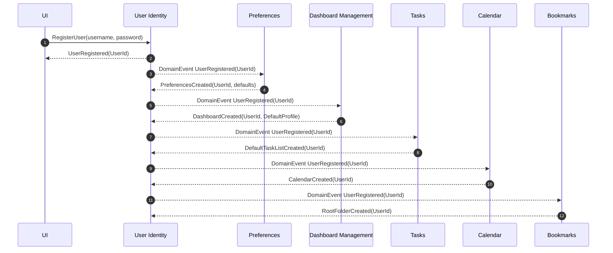
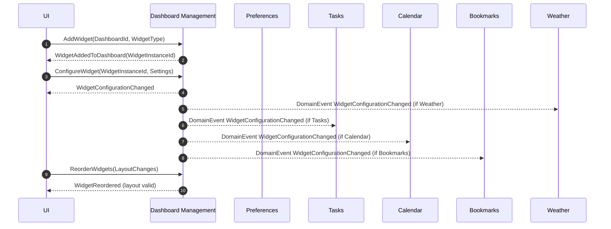
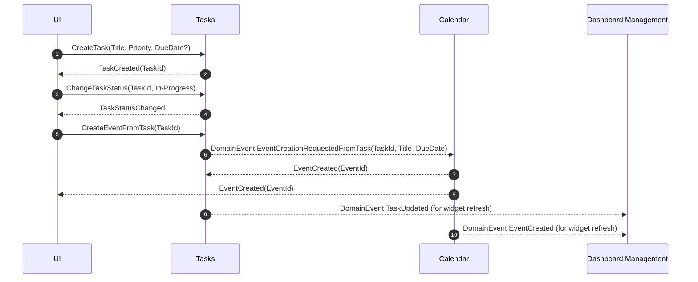
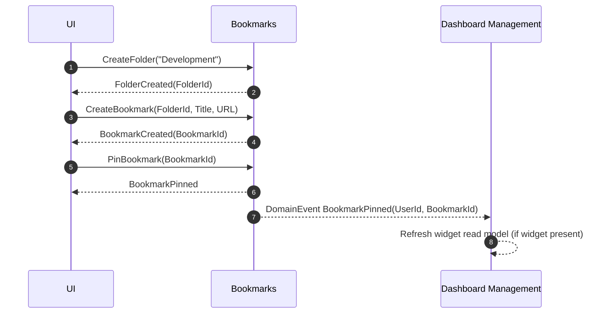
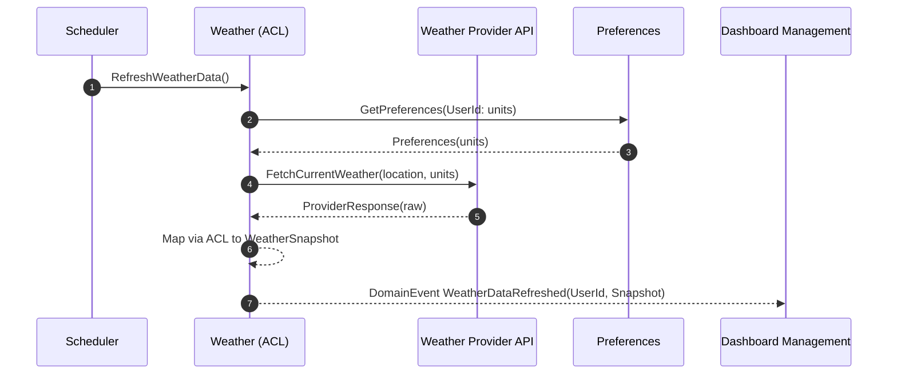
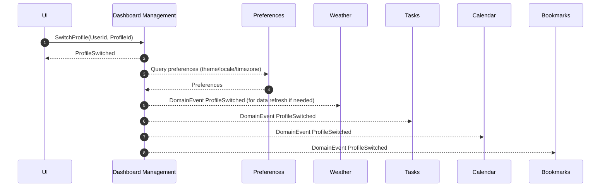
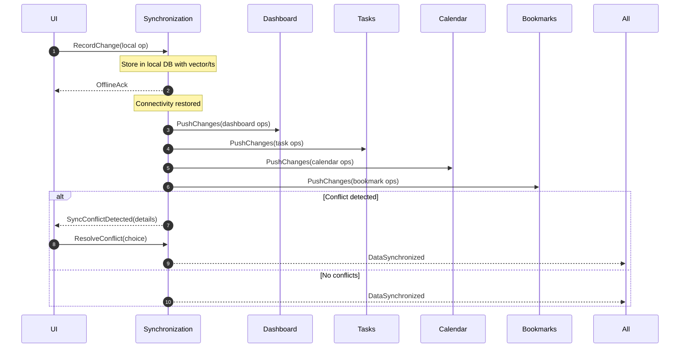
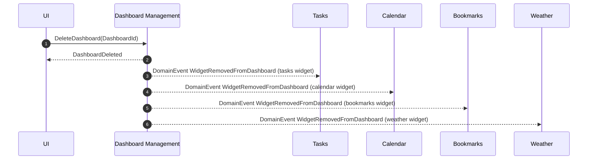

# Processes and workflows

This section describes key end-to-end workflows across bounded contexts. Diagrams are expressed in BPMN‑like notation
using Mermaid for readability. Each workflow includes a brief narrative.

:::note Legend

- Pools represent bounded contexts
- Events: (o) Start, (x) End
- Tasks: Rounded rectangles
- Messages: Dashed arrows across pools
- Data stores: Implicit per context; no cross‑DB calls

:::

---

## User onboarding

Narrative: When a user registers, foundational contexts initialize defaults so the system is immediately usable.

Key outputs:

- UserPreferences created
- Default Dashboard with profile
- Default TaskList, Calendar, and Bookmarks root folder

---

## Compose a dashboard (Add/Configure/Reorder widgets)

Narrative: A user personalizes their dashboard by adding a widget instance, configuring it, and reordering layout
positions.

Policy guards:

- Layout positions cannot overlap
- Widget type must be supported
- Configuration validated by supplier contexts when applicable

---

## Manage tasks and create calendar event from a task

Narrative: A user updates the task state and optionally creates a related calendar event.

Invariants:

- Task status must be valid (Todo/In‑Progress/Done)
- Calendar enforces start < end
- Event creation is one‑way; no hard coupling

---

## Bookmarks management and pin to speed dial

Narrative: A user organizes bookmarks and pins favorites for quick access on the dashboard.

Constraints:

- URL must be valid
- Folder hierarchy maintained
- Pinned set scoped to user

---

## Weather data refresh with ACL

Narrative: Weather context refreshes data from an external provider using an anti‑corruption layer and notifies widgets.

Policies:

- Cache with TTL and rate limiting
- Provider errors produce WeatherFetchFailed events

---

## Switch profile

Narrative: User switches between personalization profiles; dashboard restores saved layout and widget configurations.

Rules:

- Profile must exist for the user
- Restored layout must pass layout policy

---

## Offline first and synchronization

Narrative: User operates offline; when connectivity is restored, changes synchronize to the cloud and conflicts are
resolved.

MVP strategy:

- Last‑write‑wins with timestamps
- Eventual consistency across contexts

---

## Delete dashboard and cleanup

Narrative: User deletes a dashboard; widget instances are removed while data in supporting contexts remains intact.

Principle:

- Dashboard removal does not delete domain data from supplier contexts
- Only composition/layout artifacts are removed
